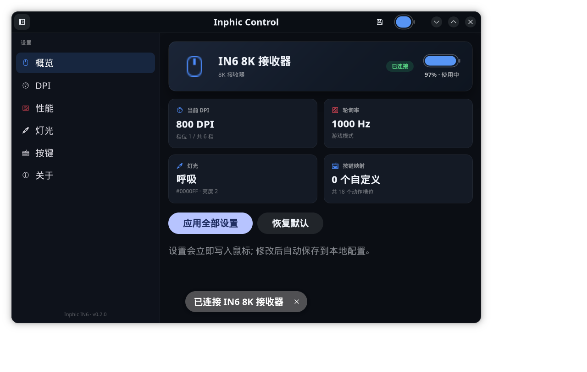

# Inphic Control

为 **Inphic IN6（三模 / 8K 接收器）** 打造的 Linux 控制面板。
现代深色界面（GTK4 + libadwaita），直接通过厂商 HID 接口通信，无需 Windows 驱动。



## 功能

| 功能 | 说明 |
| --- | --- |
| DPI | 8 个档位，50–26000，可单独启用/禁用、设置档位指示灯颜色、切换当前档位 |
| 轮询率 | 125 / 250 / 500 / 1000 / 2000 / 4000 / 8000 Hz |
| 传感器 | 波纹控制、角度捕捉、运动同步、抬起高度（1/2 mm） |
| 电源 | 浅睡时间（0.5–30 分钟）、深度休眠（1–60 分钟） |
| 按键 | 去抖时间（4–50 ms） |
| 灯光 | 关闭 / 常亮 / 呼吸 / 霓虹 / 循环呼吸 / DPI 常亮 / DPI 呼吸，颜色与亮度/速度 |
| 按键映射 | 左键、右键、中键、前进、后退，支持鼠标功能、多媒体、系统快捷键、自定义键盘组合键 |
| 宏 | 键盘按键（按下/抬起）+ 鼠标移动，4 种触发方式（循环 N 次 / 任意键停止 / 按住播放 / 宏键停止），每键一个宏 |
| 电量 | 实时电量与充电状态 |
| 配置持久化 | 设置保存于 `~/.config/inphic-control/config.json` |
| 休眠重试 | 鼠标休眠时命令自动按 1s/6s/21s 递进重试，唤醒后自动生效 |

## 安装

```bash
sudo dnf install ./inphic-control-0.3.0-1.*.noarch.rpm
```

安装后 **重新插拔一次接收器**（或注销重登），udev 规则会授予当前登录用户
hidraw 设备的访问权限，之后即可在应用菜单中打开「Inphic 控制」。

## 使用

```bash
inphic-control            # 图形界面
inphic-control --probe    # 命令行诊断: 列出设备并监听电量/事件
inphic-control --probe --apply   # 写入当前配置并监听
```

如果提示没有权限，可临时授权：

```bash
sudo setfacl -m u:$USER:rw /dev/hidrawN
```

## 打包

各发行版打包共用根目录 `Makefile` 的安装规则，脚本位于 `packaging/`：

| 目标 | 命令 | 产物 |
| --- | --- | --- |
| Fedora / RHEL / openSUSE (RPM) | `./packaging/build-rpm.sh` | `~/rpmbuild/RPMS/noarch/*.rpm` |
| Debian / Ubuntu (DEB) | `./packaging/build-deb.sh` | `dist/deb/*.deb` |
| Arch Linux | `./packaging/build-arch.sh`（需 Arch 环境） | `packaging/arch/*.pkg.tar.zst` |
| Flatpak（跨发行版） | `./packaging/build-flatpak.sh` | `dist/inphic-control.flatpak` |

RPM 构建依赖 `rpm-build`，DEB 依赖 `dpkg-dev`、`debhelper`，Flatpak 依赖
`flatpak-builder`；运行依赖均为 `python3-gobject`、`gtk4`、`libadwaita`。
发布到 COPR / OBS / PPA / AUR / Flathub 等方法详见
[packaging/README.md](packaging/README.md)。

## 协议说明

接收器（`1d57:fa65`）是一个复合 HID 设备，其中 USB 接口 3 为厂商自定义接口
（Usage Page `0xFF00`，Report ID `4`）。配置命令通过该接口的 Output Report 发送。

**写入帧格式**（由官方 Windows 驱动逆向确认）：

```
[0x04] [总长+5] [0x00] <命令载荷> [校验和高] [校验和低]
校验和 = 从第 0 字节到载荷末尾的所有字节之和 (16 位)
```

命令载荷第一个字节即命令类型：

| 类型 | 长度 | 功能 |
| --- | --- | --- |
| `0x04` | 56 | DPI / 传感器 |
| `0x05` | 15 | 灯光 / 睡眠 / 去抖 |
| `0x06` | 9 | 轮询率 |
| `0x08` | 59 | 按键映射 |
| `0x09` | 111 | 宏 (两页分包: `04 40` 页0 59字节 + `04 39` 页1 52字节, 各带校验和) |

**设备响应**（Input Report，Report ID 4）：

- `06 c0 01 00 xx` — 接收器确认（校验和通过，约 30ms）
- `06 c1 01 00 xx` — 鼠标确认已应用（约 0.7s）
- `06 c1 00 00 xx` — 鼠标未确认（约 2.1s，常见于鼠标休眠）
- `03 41 40 <状态> <电量>` — 电量上报（约每 2 秒）

协议来自官方 Web 驱动（`hub.inphic.cn`）与官方 Windows 驱动
（INPHIC YU Setup，`hiddriver.dll` / `INPHIC.exe`）的逆向分析，
并与以下社区项目的公开文档交叉验证：

- [HarukaYamamoto0/attack-shark-x11-driver](https://github.com/HarukaYamamoto0/attack-shark-x11-driver)（MIT）
- [D3m0nZOnFire/mousectl](https://github.com/D3m0nZOnFire/mousectl)（MIT）

## 已知限制

- **宏编辑暂未支持**：宏指令为 111/131 字节，需要分包写入，官方原生驱动
  的分包格式尚未完全弄清。按键可以正常绑定到鼠标/键盘/多媒体功能。
- **不支持读取鼠标中的当前设置**：官方 Web 驱动本身也只写不读，本软件采用
  相同的策略；界面显示的是本地保存的配置。
- 部分设置（如 DPI）写入后立即生效，不需要点击保存。

## 免责声明

本软件与 Inphic 官方无关，为社区逆向成果。写入未知设置存在风险，
请自行承担。设备无响应时可切换到蓝牙模式几秒后再切回。

## 许可

MIT
